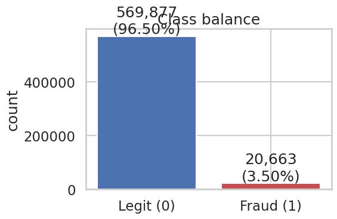
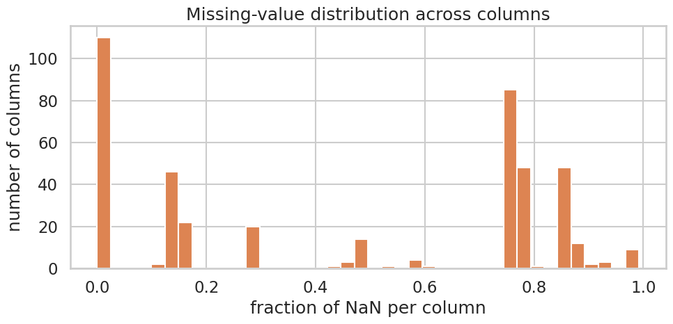
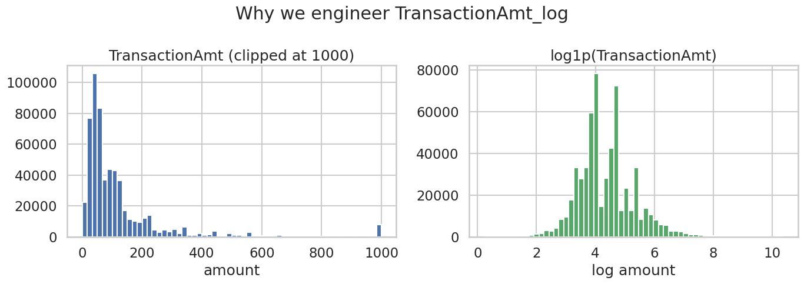
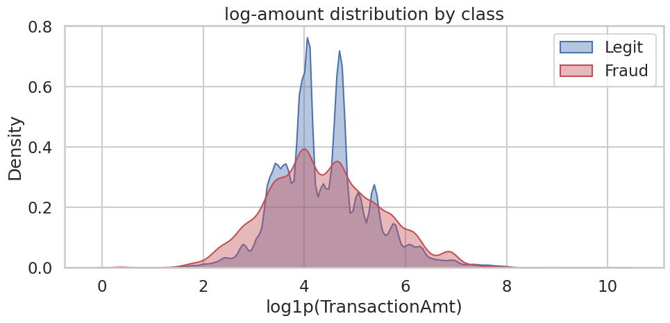
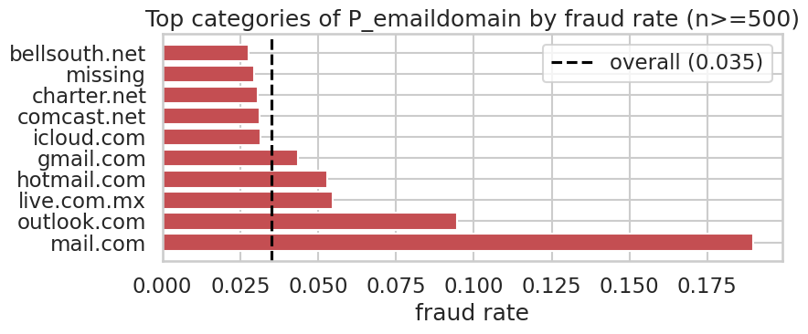
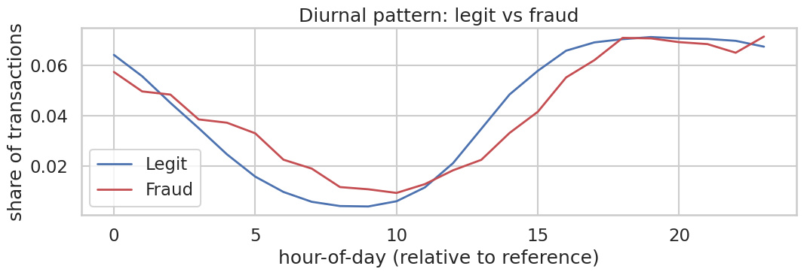
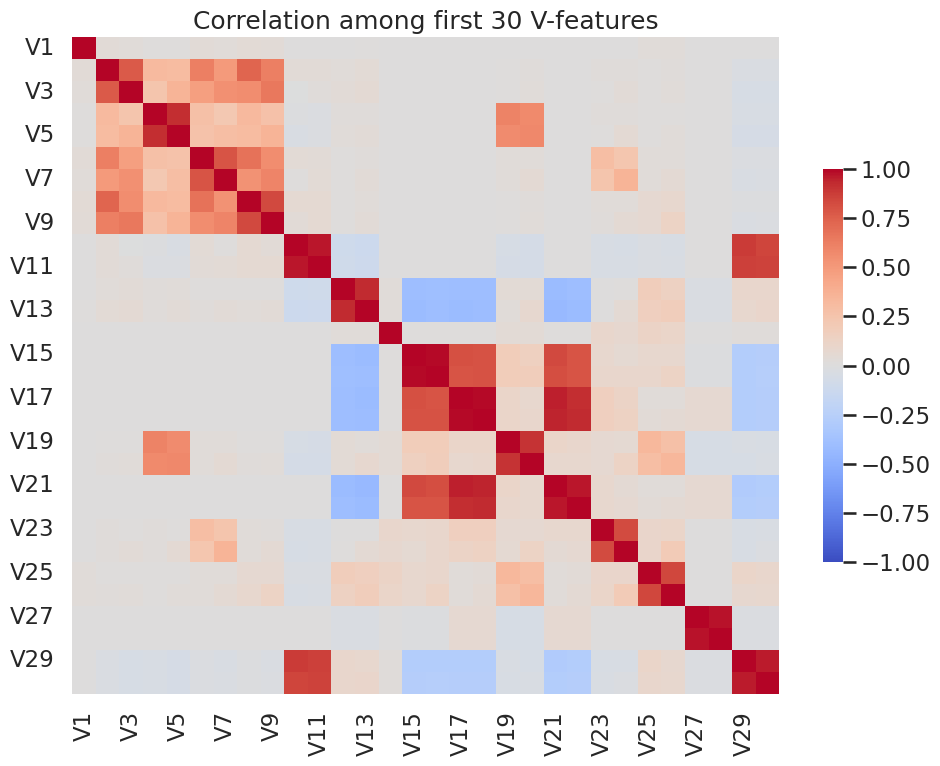

# IEEE-CIS Fraud Detection

## Kaggle-ის კონკურსის მოკლე მიმოხილვა

[IEEE-CIS Fraud Detection](https://www.kaggle.com/competitions/ieee-fraud-detection) - ამოცანა მდგომარეობს ონლაინ ტრანზაქციებში თაღლითობის ამოცნობაში. მონაცემები მოწოდებულია Vesta Corporation-ის მიერ და შედგება ორი წყაროსგან:

- `train_transaction.csv` / `test_transaction.csv` — ტრანზაქციის ჩანაწერი (თანხა, ბარათის ტიპი, საფოსტო კოდი, ელ.ფოსტის დომენი, 339 ანონიმიზებული V-ფიჩერი).
- `train_identity.csv` / `test_identity.csv` — დამატებითი იდენტიფიკაციის ინფორმაცია (მოწყობილობა, ბრაუზერი, IP). მიერთებულია ტრანზაქციების მხოლოდ ~25%-ზე.

გაერთიანების შემდეგ ვიღებთ ~590,000 სტრიქონს და ~434 სვეტს. სამიზნე ცვლადი — `isFraud` (ბინარული, ~3.5% დადებითი კლასი). შეფასების მეტრიკა — ROC-AUC.

GitHub: https://github.com/Saba0033/ML_Asgn2
DagsHub MLflow: https://dagshub.com/Saba0033/ML_Asgn2.mlflow

## ჩემი მიდგომა

თითოეული მოდელის არქიტექტურისთვის შევქმენი ცალკე notebook და ცალკე MLflow ექსპერიმენტი. თითოეულ notebook-ში ვამოწმებ რამდენიმე imputation სტრატეგიას, სამ feature selection მიდგომას და hyperparameter-ების გრიდს, რომელიც განზრახ მოიცავს underfit, well-fit და overfit კონფიგურაციებს. საუკეთესო კონფიგურაციას ვამოწმებ 3-fold cross-validation-ით და შემდეგ ვინახავ Pipeline-ად MLflow-ში. ყველა არქიტექტურიდან საუკეთესოს ვარეგისტრირებ Model Registry-ში სახელით `IEEEFraudBestModel`. inference notebook პირდაპირ ჩატვირთავს registry-დან და რან-ავს raw test-ზე.

ჯამში გავტესტე 7 არქიტექტურა: Logistic Regression (L1), Logistic Regression (L2), Decision Tree, Random Forest, AdaBoost, Gradient Boosting (sklearn HistGB), XGBoost.

## რეპოზიტორიის სტრუქტურა

```
ML_Asgn2/
├── README.md
├── requirements.txt
├── .gitignore
├── _render_results_table.py                        — ცხრილი results_cache.json-დან
├── results_cache.json                              — per-notebook cached metrics
│
├── 00_eda.ipynb                                    — EDA + plots/-ში გრაფიკები
│
├── model_experiment_LogisticRegression.ipynb       — LogReg L2
├── model_experiment_LogisticRegression_L1.ipynb    — LogReg L1
├── model_experiment_DecisionTree.ipynb
├── model_experiment_RandomForest.ipynb
├── model_experiment_AdaBoost.ipynb
├── model_experiment_GradientBoosting.ipynb
├── model_experiment_XGBoost.ipynb
│
├── model_inference.ipynb                           — registry-დან ჩატვირთვა + submission
│
├── src/
│   ├── data_utils.py                               — load_train, load_test, split_columns
│   ├── preprocessing.py                            — preprocessor-ები + CorrelationPruner
│   └── mlflow_utils.py                             — DagsHub init + named runs + metrics
│
├── data/                                           — Kaggle CSVs (gitignored)
├── plots/                                          — EDA-ს გრაფიკები
└── submissions/                                    — submission.csv
```

ყველა model_experiment notebook ერთი და იგივე სტრუქტურით:

1. Setup
2. Data Loading
3. Cleaning — MLflow runs სხვადასხვა imputation სტრატეგიისთვის
4. Feature Engineering — MLflow run engineered ფიჩერების lift-ისთვის
5. Feature Selection — MLflow runs სამი მიდგომისთვის
6. Training & Hyperparameter Tuning — MLflow run ყოველ HP combo-ზე
7. Cross-Validation of the Best Configuration
8. Final Pipeline + Optional Registration

## EDA

ყველა გრაფიკი იწერება `00_eda.ipynb`-ის გაშვებისას `plots/` დირექტორიაში.

### კლასების ბალანსი

დადებითი კლასი (`isFraud=1`) მხოლოდ ~3.5%. accuracy აქ არ ვარგა — ოპტიმიზაცია ROC-AUC-ზე, მონიტორინგი PR-AUC-ზე.



### ცარიელი მნიშვნელობები

დატასეტში სვეტების უმეტესობას NaN აქვს, ბევრს — 50%-ზე მეტი. NaN-ის სტრუქტურა თავისთავად სიგნალია, ამიტომ tree მოდელებისთვის ვირჩევ sentinel imputation-ს (`-999`).



### TransactionAmt-ის განაწილება

Raw თანხა heavy-tailed; `log1p` ანაწილებს გაცილებით სიმეტრიულად. ამიტომ `TransactionAmt_log` ფიჩერი ემატება ყოველ pipeline-ში.

 

### კატეგორიული ფიჩერები vs fraud rate

`P_emaildomain`-ისა და `card4`-ის ზოგიერთ კატეგორიაში fraud rate აღწევს საშუალოს ~5x-ს. ეს ამართლებს email TLD-ის (suffix) ფიჩერად გამოყოფას.



### დროის სტრუქტურა



### V-ფიჩერების კორელაცია

339 ანონიმიზებული V-ფიჩერი მაღალ-კორელირებულია. ეს ამართლებს correlation-pruning selector-ს feature selection ეტაპზე.



## Feature Engineering

### კატეგორიული ცვლადების რიცხვითში გადაყვანა

| მოდელის ტიპი | მიდგომა | რატომ |
|---|---|---|
| ლინეარული (LogReg L1/L2) | OneHotEncoder, `max_categories=20`, `min_frequency=0.001` | ლინეარულ მოდელს თითო კატეგორიის სვეტი ცალ-ცალკე სჭირდება. cap აუცილებელია — `DeviceInfo`/`id_31`-ს 5000+ უნიკალური მნიშვნელობა აქვს. |
| Tree-based | OrdinalEncoder | ხეები ბუნებრივად იმუშავებენ რიცხვით კოდებზე; OHE 430 ფიჩერისგან 5000+ შექმნიდა. |

ორივე pipeline-ი იწყება `_to_string_block` ეტაპით, რომელიც mixed numeric+NaN კატეგორიულ სვეტებს (`card1`, `addr1`) აყოფს უნიფიცირებულ string-ებად — სხვაგვარად encoder ვერ მუშაობს.

### NaN მნიშვნელობების დამუშავება

| სტრატეგია | სად ვტესტავ | run name | მოლოდინი |
|---|---|---|---|
| `median` (numeric) + `'missing'` (categorical) | linear notebook | `LogReg_*_Cleaning_maxcats*` | სტანდარტული |
| `0.0` fill | tree notebook | `*_Cleaning_fill0` | ნეიტრალური; სუსტდება NaN-სიგნალი |
| `-999.0` fill (sentinel) | tree notebook | `*_Cleaning_fill-999` | სავარაუდო გამარჯვებული tree-ისთვის |

### დამატებითი ფიჩერები

ყველა ერთიდაიგივე — `src/preprocessing.engineer_features`-ში:

| ფიჩერი | ფორმულა | მოტივაცია |
|---|---|---|
| `TransactionAmt_log` | `np.log1p(TransactionAmt)` | EDA: heavy-tailed განაწილება |
| `P_emaildomain_suffix` | TLD payer email-ის | EDA: TLD ატარებს fraud სიგნალის უმეტესობას |
| `R_emaildomain_suffix` | TLD recipient email-ის | სიმეტრიულად |

### Cleaning მიდგომები

- `src.data_utils.reduce_mem_usage` — numeric dtype-ების downcast-ი ამცირებს გაერთიანებული train ცხრილის ზომას ~1.4 GB-დან ~600 MB-მდე.
- `load_train(sample_frac=0.3)` — სტრატიფიცირებული sub-sampling ლოკალური ექსპერიმენტებისთვის.
- `load_test` ნორმალიზებს Kaggle-ის `id-XX` (test_identity) → `id_XX` (train_identity) სვეტების სახელებს.

## Feature Selection

თითოეულ notebook-ში სამი selector — თითოეული ცალკე MLflow run-ად, `n_features_kept` მეტრიკით.

| Selector | სად ვიყენებ | ტიპი |
|---|---|---|
| VarianceThreshold | ყველგან — drop near-constant columns | filter |
| CorrelationPruner (custom) | tree notebooks — V-ბლოკი ძლიერ კორელირებულია | filter |
| SelectFromModel(RandomForest) | tree notebooks | embedded |
| SelectFromModel(LogReg L1) | linear notebooks | embedded (კანონიკური GLM-style) |

შერჩევის წესი:

```
selection_score = val_roc_auc - 0.5 * max(0, overfit_gap - 0.02)
```

ანუ ვირჩევთ მაღალი val_AUC-ის მქონეს, მაგრამ ვაჯარიმებთ თუ overfit_gap > 2%. argmax(val_AUC) მარტო რომ გამოვეყენებინა, ხშირად ჩავარდებოდა აშკარად overfit-ულ მოდელზე.

## Training

### ტესტირებული მოდელები

| # | არქიტექტურა | MLflow ექსპერიმენტი |
|---|---|---|
| 1 | Logistic Regression (L2) | `LogisticRegression_L2_Training` |
| 2 | Logistic Regression (L1) | `LogisticRegression_L1_Training` |
| 3 | Decision Tree | `DecisionTree_Training` |
| 4 | Random Forest | `RandomForest_Training` |
| 5 | AdaBoost | `AdaBoost_Training` |
| 6 | Gradient Boosting (HistGB) | `GradientBoosting_Training` |
| 7 | XGBoost | `XGBoost_Training` |

### Hyperparameter ოპტიმიზაცია

დავალების ინსტრუქცია ცხადად ამბობს რომ overfit/underfit რეჟიმების ჩვენება უფრო მნიშვნელოვანია ვიდრე უმაღლესი score. ამიტომ ყველა HP გრიდი მოიცავს ორივე ექსტრემუმს. მაგალითი XGBoost-ისთვის:

| n_estimators | learning_rate | max_depth | მოსალოდნელი რეჟიმი |
|---|---|---|---|
| 100 | 0.30 | 3 | underfit |
| 200 | 0.10 | 4 | well-fit |
| 400 | 0.05 | 6 | well-fit |
| 600 | 0.05 | 8 | well-fit |
| 800 | 0.03 | 10 | well-fit-ის ზღვარი |
| 800 | 0.30 | 12 | overfit demo |

ანალოგიური სტრუქტურა DT, RF, AdaBoost, GradientBoosting გრიდებში. LogReg-ში ვცვლი მხოლოდ `C`-ს (0.001 → 10).

შერჩევის წესი იგივე `selection_score`. შერჩეული combo შემდეგ გადის 3-fold StratifiedKFold-ს — სტრატიფიცირება აუცილებელია იმბალანსირებული fraud-ისთვის.

### საბოლოო Pipeline

- refit `pd.concat([X_train, X_val])`-ზე — val-ი HP-tuning-ში უკვე გამოვიყენე, deployed model-ი მაქსიმალური მონაცემიდან იღებს ცოდნას.
- `mlflow.sklearn.log_model(name='pipeline', signature=infer_signature(...), input_example=...)` — ხელახალი ჩატვირთვა მუშაობს raw DataFrame-ზე.
- `cache_architecture_result(...)` ანახლებს `results_cache.json`-ს.
- `if REGISTER_AS_BEST: mlflow.register_model(...)` — registry-ში მხოლოდ ერთი notebook-ის flag უნდა იყოს `True`.

### შედარების ცხრილი

ცხრილი ავტომატურად რენდერდება `python _render_results_table.py`-ით:

```
| Architecture | val ROC-AUC | overfit gap | CV ROC-AUC | CV PR-AUC | best selector | features kept |
|---|---|---|---|---|---|---|
| XGBoost          | (filled in after run) |
| GradientBoosting | ... |
| RandomForest     | ... |
| AdaBoost         | ... |
| DecisionTree     | ... |
| LogReg L1        | ... |
| LogReg L2        | ... |
```

## MLflow Tracking

ბმული: https://dagshub.com/Saba0033/ML_Asgn2.mlflow/#/experiments

### სტრუქტურა

თითოეული არქიტექტურა — ცალკე ექსპერიმენტი, შიგნით კი დასახელებული run-ები pipeline-ის ეტაპების მიხედვით. მაგალითი XGBoost-ისთვის:

```
XGBoost_Training/
    XGBoost_Cleaning_fill-999
    XGBoost_Cleaning_fill0
    XGBoost_FeatureEngineering
    XGBoost_FeatureSelection_variance
    XGBoost_FeatureSelection_correlation
    XGBoost_FeatureSelection_model_based
    XGBoost_HP_n100_lr0p3_d3_ss1p0_cs1p0
    XGBoost_HP_n200_lr0p1_d4_ss0p9_cs0p9
    XGBoost_HP_n400_lr0p05_d6_ss0p8_cs0p8
    XGBoost_HP_n600_lr0p05_d8_ss0p8_cs0p7
    XGBoost_HP_n800_lr0p03_d10_ss0p7_cs0p6
    XGBoost_HP_n800_lr0p3_d12_ss1p0_cs1p0
    XGBoost_CrossValidation
    XGBoost_FinalPipeline
```

LogReg-ის HP run-ები: `LogReg_L2_HP_C0p001`, ... `LogReg_L2_HP_C10p0`.
LogReg-ის FS run-ები: `LogReg_L2_FeatureSelection_variance`, `_l1_logreg`, `_rf_importance`.

### ჩაწერილი მეტრიკები

თითოეული run ლოგავს train + val ბანდლს (`evaluate_train_val` `src/mlflow_utils.py`-ში):

| მეტრიკა | აღწერა |
|---|---|
| `train_roc_auc`, `val_roc_auc` | მთავარი მეტრიკა (Kaggle-ის შეფასება) |
| `train_pr_auc`, `val_pr_auc` | Precision-Recall AUC — მნიშვნელოვანია იმბალანსირებული მონაცემებისთვის |
| `train_accuracy`, `val_accuracy`, `train_f1`, `val_f1`, ... | სრულყოფისთვის |
| `overfit_gap` | `train_roc_auc - val_roc_auc` |
| `selection_score` | overfit-აჯარიმებული val AUC (HP runs-ში) |
| `n_features_kept` | feature selection runs-ში |
| `cv_val_roc_auc_mean / std`, `cv_val_pr_auc_mean`, `cv_overfit_gap` | CV runs-ში |

### საუკეთესო მოდელის შედეგები

საბოლოო Pipeline ლოგდება `signature` + `input_example`-ით, ანუ Model Registry-დან ჩატვირთული მოდელი იცის რომელ სვეტებს ელოდება. `model_inference.ipynb` ოპერირებს raw test DataFrame-ზე, ყოველგვარი დამატებითი preprocessing-ის გარეშე.

## როგორ გავუშვა

```bash
# 1. გარემო
python -m venv env
source env/bin/activate
pip install -r requirements.txt

# 2. მონაცემები
pip install kaggle
kaggle competitions download -c ieee-fraud-detection -p data/
cd data && unzip -o ieee-fraud-detection.zip && cd ..

# 3. EDA
jupyter notebook 00_eda.ipynb

# 4. ცალ-ცალკე ყოველი მოდელის notebook
jupyter notebook model_experiment_XGBoost.ipynb
# ... და დანარჩენი 6

# 5. შედარების ცხრილი
python _render_results_table.py

# 6. გამარჯვებული notebook-ში REGISTER_AS_BEST = True, ხელახლა გაუშვი §8

# 7. inference + Kaggle submission
jupyter notebook model_inference.ipynb
kaggle competitions submit -c ieee-fraud-detection -f submissions/submission.csv -m "from registry"
```
